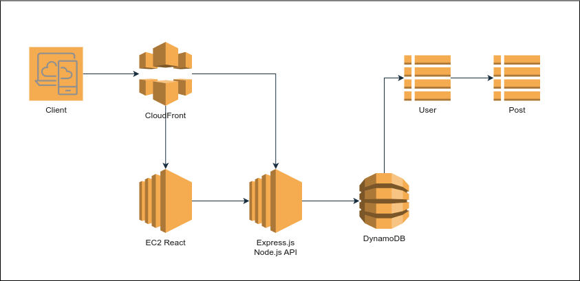
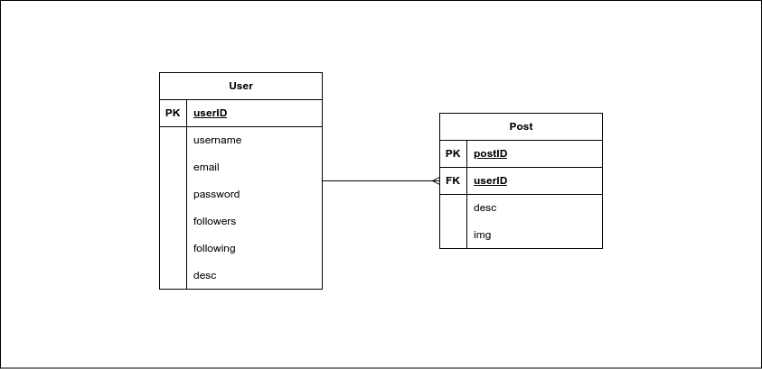

<a name="readme-top"></a>

<div align="center">
  <!-- You are encouraged to replace this logo with your own! Otherwise you can also remove it. -->

  <h3><b>Image Sharing API</b></h3>
  
  <br/>

</div>

<!-- TABLE OF CONTENTS -->

# 📗 Table of Contents

- [📖 About the Project](#about-project)
  - [🛠 Built With](#built-with)
    - [Tech Stack](#tech-stack)
    - [Key Features](#key-features)
  - [🚀 Live Demo](#live-demo)
- [💻 Getting Started](#getting-started)
  - [Setup](#setup)
  - [Prerequisites](#prerequisites)
  - [Install](#install)
  - [Usage](#usage)
  - [Run tests](#run-tests)
  - [Deployment](#triangular_flag_on_post-deployment)
- [📝 Documentation](#documentation)
- [👥 Authors](#authors)
- [🔭 Future Features](#future-features)
- [🤝 Contributing](#contributing)
- [⭐️ Show your support](#support)
- [🙏 Acknowledgements](#acknowledgements)
- [❓ FAQ](#faq)

<!-- PROJECT DESCRIPTION -->

# 📖 Image Sharing API<a name="about-project"></a>

This API will provide users the ability to register, login, create and update image posts. After registering, users will be able to manage their details: username, email, and profile picture, The API will handle image uploads, allowing users to create image posts with optional descriptions.

## 🛠 Built With <a name="built-with"></a>

### Tech Stack <a name="tech-stack"></a>

> API designed to serve a React frontend. Built with Express.js on top of Node.js and a DynamoDB, teherefore it would be ideal to deploy in a AWS cloud.

<details>
  <summary>Client: React</summary>
  <ul>
    <li><a href="https://reactjs.org/">React.js</a></li>
  </ul>
  <ul>
    <li><a href=""></a></li>
  </ul>
  <ul>
    <li><a href=""></a></li>
  </ul>
  <ul>
    <li><a href=""></a></li>
  </ul>
</details>

<details>
  <summary>Backend: Express.js</summary>
  <ul>
    <li><a href="https://expressjs.com/">Express.js</a></li>
  </ul>
  <ul>
    <li><a href="">Multer - Image upload</a></li>
  </ul>
  <ul>
    <li><a href=""></a></li>
  </ul>
  <ul>
    <li><a href=""></a></li>
  </ul>
</details>

<details>
<summary>Database</summary>
  <ul>
    <li><a href="https://www.postgresql.org/">DynamoDB</a></li>
  </ul>
</details>

<!-- Features -->

### Design <a name="key-features"></a>




> Main features:

- **Register and Login users**
- **Users will be able to manage username, email, password and profile picture.**
- **Create and update user's own image posts with optional captions descriptions.**
- **The API will handle all image uploads.**

<p align="right">(<a href="#readme-top">back to top</a>)</p>

<!-- LIVE DEMO -->

## 🚀 Live Demo <a name="live-demo"></a>

> In progress...

- [Live Demo Link]()

<p align="right">(<a href="#readme-top">back to top</a>)</p>

<!-- GETTING STARTED -->

## 💻 Getting Started <a name="getting-started"></a>

### Prerequisites

In order to run this project you need:

<!--
Example command:

```sh
 gem install rails
```
 -->

### Setup

Clone this repository to your desired folder:

<!--
Example commands:

```sh
  cd my-folder
  git clone git@github.com:myaccount/my-project.git
```
--->

### Install

Install this project with:

<!--
Example command:

```sh
  cd my-project
  gem install
```
--->

### Usage

To run the project, execute the following command:

<!--
Example command:

```sh
  rails server
```
--->

### Run tests

To run tests, run the following command:

<!--
Example command:

```sh
  bin/rails test test/models/article_test.rb
```
--->

### Deployment

You can deploy this project using:

<!--
Example:

```sh

```
 -->

<p align="right">(<a href="#readme-top">back to top</a>)</p>

<!-- DOCUMENTATION -->

## 📝 Documentation <a name="documentation"></a>

[Postman API Documentation](https://documenter.getpostman.com/view/13849307/2sAYBd67yZ)

<p align="right">(<a href="#readme-top">back to top</a>)</p>

<!-- AUTHORS -->

## 👥 Author <a name="authors"></a>

👤 **Marcos Hernández Campos**

- Github: [@marcoshdezcam](https://github.com/marcoshdezcam)
- Twitter: [@MarcosHCampos](https://twitter.com/MarcosHCampos)
- Linkedin: [Marcos Hernández](https://linkedin.com/marcos-hernández-56058119a/)

<p align="right">(<a href="#readme-top">back to top</a>)</p>

<!-- FAQ (optional) -->

## ❓ FAQ <a name="faq"></a>

>

<p align="right">(<a href="#readme-top">back to top</a>)</p>
